<picture>
  <source media="(prefers-color-scheme: dark)" srcset="./dark.svg">
  <source media="(prefers-color-scheme: light)" srcset="./light.svg">
  
</picture>

## About

I'm a software engineer who builds React and TypeScript applications and the Python and FastAPI services behind them. My work so far is project-driven: full-stack apps with responsive interfaces, REST APIs, tests, and containerized backends, some of them with AI-enabled features.

I hold an M.S. in Computer Science from the University of Central Missouri, along with the AWS Certified Solutions Architect – Associate and Microsoft Certified: Azure AI Engineer Associate certifications.

## Featured Projects

### [ContextBridge](https://github.com/saikumarreddy2001/contextbridge) · [Live demo](https://contextbridge-portfolio.web.app)
`React` `TypeScript` `React Flow` `FastAPI` `Python` `Docker` `Firebase`

Rebuilds fragmented project activity into a personalized "What Did I Miss?" view of decisions, blockers, requirements, and tasks.

- Interactive context graph with Trace Why and Trace Impact, a synchronized timeline, contextual search, evidence views, and responsive, route-based navigation.
- FastAPI reconstruction engine for event normalization, entity resolution, relationship mapping, change detection, and evidence provenance, with a deterministic AI fallback.
- Backend is Dockerized and covered by 27 passing tests. The React frontend is live on Firebase Hosting; the backend is prepared for Google Cloud Run but is not publicly deployed.

### [Pondr](https://github.com/saikumarreddy2001/pondr) · [Live demo](https://pondr-ai.vercel.app)
`React Native` `TypeScript` `LangGraph` `Supabase`

A voice-first AI thinking partner for talking through decisions, built with React Native and TypeScript and connected to multi-agent reasoning workflows and backend services.

### [Multi-Agent Research Assistant](https://github.com/saikumarreddy2001/multi-agent-research) · [Live demo](https://multi-agent-research.streamlit.app)
`Python` `FastAPI` `LangGraph` `LangChain`

Researches a topic on the web, summarizes, fact-checks, and writes a structured report using LangGraph workflows, exposed through FastAPI with a Streamlit interface.

### More on GitHub
- [computer-use-automation](https://github.com/saikumarreddy2001/computer-use-automation): LLM-driven computer-use discovery with typed capability artifacts and deterministic replay.
- [MLOps_Pipeline_model](https://github.com/saikumarreddy2001/MLOps_Pipeline_model): trains three scikit-learn classifiers, tracks experiments and a model registry in MLflow, detects drift with Evidently AI, and shows results on a Streamlit dashboard.
- [SmartBank](https://github.com/saikumarreddy2001/SmartBank): Java, Spring MVC, JPA, JSP, and MySQL banking app with OTP-based login and role-based access.
- [Gated-Community](https://github.com/saikumarreddy2001/Gated-Community): Java Servlets, JSP, JDBC, and MySQL community management app.
- [MarketInsight](https://github.com/saikumarreddy2001/MarketInsight): AI-powered stock market analysis through a conversational interface.

## Engineering Stack

| | |
|---|---|
| **Languages** | TypeScript, JavaScript, Java, Python, SQL |
| **Frontend** | React, React Router, React Flow, React Native, HTML, CSS, responsive design |
| **Backend & APIs** | FastAPI, Flask, REST APIs, Pydantic |
| **AI & Search** | RAG, LangChain, LangGraph, semantic and hybrid search, embeddings, FAISS |
| **Cloud & DevOps** | GCP, Firebase Hosting, Docker, Git, GitHub Actions, CI/CD, AWS, Azure |
| **Data** | Pandas, NumPy |

## Connect

[GitHub](https://github.com/saikumarreddy2001) · [ContextBridge](https://contextbridge-portfolio.web.app) · [Pondr](https://pondr-ai.vercel.app) · [Multi-Agent Research](https://multi-agent-research.streamlit.app)
